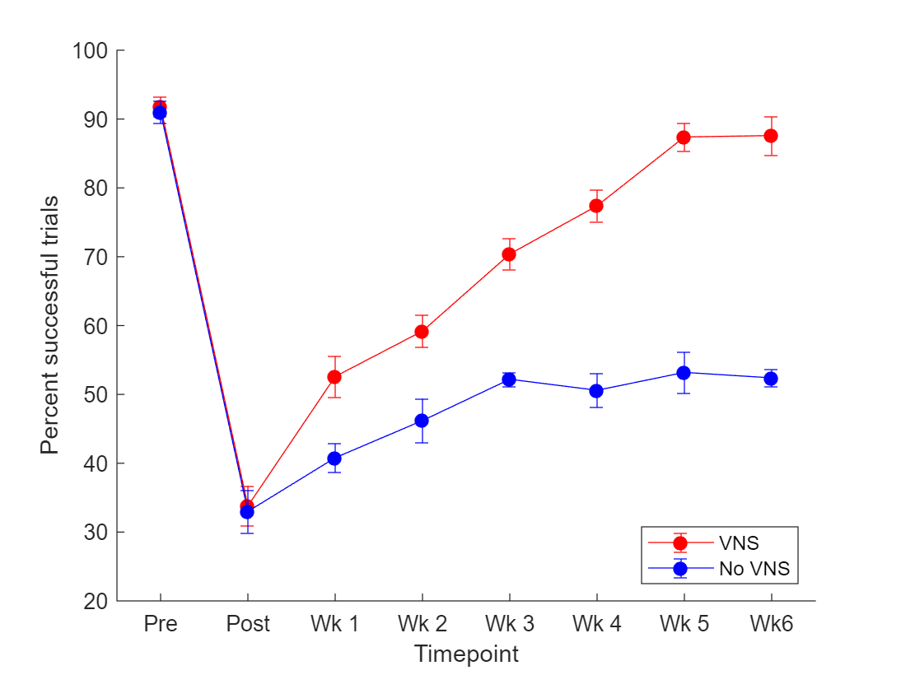

# Part 1: Basic concepts and the most commonly used statistical tests
  
## 1.1 Variables: Independent vs Dependent
  

**Independent variables** are variables we have control over. Typical examples from our lab:

   -  Is the subject receiving vagus nerve stimulation (VNS) or not? 
   -  Does the subject have some kind of injury (stroke, spinal cord injury, TBI, etc) 
   -  What intensity of VNS is the subject receiving (No VNS, 0.4 mA, 0.8 mA, 1.6 mA, etc.) 

**Dependent variables** are variables that we observe or measure. Typical examples from our lab:

   -  The percent of successful trials on a behavioral task 
   -  In a motor map, the number of forelimb sites that we found 
   -  In a clinical trial, the amount of increase/decrease in the subject's clinical score (such as Fugl-Meyer, etc) 

## 1.2 Unpaired vs Paired Statistical Tests
  

It is important that you know whether the data you are comparing is "unpaired" or "paired". In a **paired** design, multiple samples typically come from the same subject, or multiple samples have some sort of "dependence" on each other.

In an **unpaired** design, samples are "independent" from each other.

Example of an unpaired test:

   -  In a rat study, comparing the pre-lesion performance of 2 groups of rats on a behavioral task. 

Example of a paired test:

   -  In a rat study, comparing pre-lesion performance of a single group of rats with that same group's post-lesion performance. 

## 1.3 Reporting p-values
  

There is a movement within academia to rely less upon **p-values**, because it happens too often that scientists will resort to "p-hacking", or simply because sometimes scientists don't understand their own statistics well enough, and so they place too much emphasis on the **p-value** without considering other things.

Regardless, you need to make sure you understand p-values, and make sure you report them properly. When you submit a paper for publication, reviewers *will* look at your statistics. A full explanation of p-values is beyond the scope of this document.

Assuming your **null hypothesis** is true, the **p-value** is the probability that you would obtain your experimental result by chance. If a p-value is low enough, then we say that we "reject the null hypothesis" and "accept the alternative hypothesis".

The **null hypothesis** is that our experimental groups are not significantly different from each other.

The **alternative hypothesis** is that our experimental groups do differ from each other.

In most cases, you should report the exact p-value of a test.

Sometimes, if the p-value is extremely low (usually less than 0.001 in the neuroscience field), many scientists will simply say "p < 0.001" when reporting the p-value. However, even if the p-value is extremely low, it never hurts to include the exact value. For example, if your p-value is 0.0004, you could write it as p = 4x10^-4.

  
## 1.4 The T-Test
  

The **t-test** is one of the most simple and common tests you will use when comparing your data. Matlab has *two* t-test functions:

   -  `ttest `(used for *paired* tests) 
   -  `ttest2 `(used for *unpaired* tests) 

When comparing multiple weeks of behavior data, the t-test may be used as a *post-hoc* method for comparing individual groups at each time-point. When doing so, you also need to correct for *multiple comparisons* (more on this later). These *post-hoc* t-tests should be preceded by an appropriate ANOVA test.

  
## 1.5 Example Experiment
  

Let's do an example. For the sake of the example, let's imagine we have an experiment in which we are simply testing whether there is an effect of VNS on improving motor function in an animal model of stroke.

Let's imagine that we have trained some animals on a motor task. After training the animals on the task, we have given the animals a stroke, and then divided them into *two* experimental groups: one group receives VNS while performing motor rehabilitation, while the other group does not receive VNS.

Let's create some example data for this imaginary experiment:

```matlab:Code
data = [93 23 53 69 69 75 90 92;
        94 40 40 55 68 84 80 80;
        86 40 57 60 76 83 85 92;
        95 30 59 55 76 73 89 80;
        91 36 54 57 63 72 93 94;
        86 22 45 52 50 50 65 52;
        88 28 45 49 49 60 56 49;
        91 39 38 41 53 47 47 50;
        95 36 43 54 54 52 48 57;
        95 40 33 35 55 44 50 54];

groups = [1 1 1 1 1 2 2 2 2 2]';
```

In this example, the `data` represents a set of 10 animals in an experiment. Each *row* of the `data` matrix represents and individual animal. Each *column* of the `data` matrix represents a *timepoint* in the experiment.

So, for this experiment, we have 10 animals and 8 timepoints.

The `groups` variable indicates which experimental group each animal belongs to. So we have two groups, labeled as "1" and "2". We will imagine that group "1" received VNS, while group "2" did not receive VNS.

Let's plot our example data to see what it looks like:

```matlab:Code
%Create a figure
h = figure();
%set(h, 'units', 'inches', 'position', [0 0 4 3]);
hold on;

%Declare a variable that simply holds a value for each timepoint
t = 1:8;

%Separate the VNS data and the control data
vns_data = data(find(groups == 1), :);
control_data = data(find(groups == 2), :);

%Get the mean and standard error of the VNS group at each timepoint
vns_means = nanmean(vns_data, 1);
vns_errs = nanstd(vns_data, 1) / sqrt(size(vns_data, 1));

%Get the mean and standrd error of the control group at each timepoint
control_means = nanmean(control_data, 1);
control_errs = nanstd(control_data, 1) / sqrt(size(control_data, 1));

%Plot the data
errorbar(t, vns_means, vns_errs, vns_errs, 'color', 'r', 'markerfacecolor', 'r', 'marker', 'o');
errorbar(t, control_means, control_errs, control_errs, 'color', 'b', 'markerfacecolor', 'b', 'marker', 'o');
ylabel("Percent successful trials");
xlabel("Timepoint");
xlim([0.5 8.5]);
set(gca, 'xtick', 1:8);
set(gca, 'xticklabel', {'Pre', 'Post', 'Wk 1', 'Wk 2', 'Wk 3', 'Wk 4', 'Wk 5', 'Wk6'});
legend({"VNS", "No VNS"}, "location", "southeast");
```



  
## 1.6 Example Experiment Continued: Asking an experimental question and doing the t-test
  

Now that we have an idea of what our data looks like, let's start probing the data and asking some questions.

The first question you may ask: **"Did the stroke lesion cause an impairment in motor task performance?"**

In this scenario, a *paired t-test* is appropriate when comparing *pre-lesion* data of a single group with *post-lesion* data of that same group.

So, let's test the data and see if an impairment occurred after the stroke in each group:

```matlab:Code
%Perform paired t-tests on both the VNS group and the Control group,
%comparing their pre-lesion vs post-lesion performance data
[h1, p1] = ttest(vns_data(:, 1), vns_data(:, 2));
[h2, p2] = ttest(control_data(:, 1), control_data(:, 2));

disp(['VNS group, pre vs post, p-value = ' num2str(p1)]);
```

```text:Output
VNS group, pre vs post, p-value = 0.00016764
```

```matlab:Code
disp(['Control group, pre vs post, p-value = ' num2str(p2)]);
```

```text:Output
Control group, pre vs post, p-value = 9.7204e-06
```

In this case, since at this stage in the experiment we have not yet divided our animals into separate experimental groups, we may also choose to test all the animals as one large group:

```matlab:Code
%Test pre-lesion vs post-lesion performance of all animals
[h, p] = ttest(data(:, 1), data(:, 2));
disp(['All animals, pre vs post, p-value = ' num2str(p)]);
```

```text:Output
All animals, pre vs post, p-value = 8.8955e-10
```

  
## 1.7 Reporting your results
  

Now that you have performed a statistical test and you have the result of the test, how would you report this in your paper It's up to you to write a sentence in your paper that properly conveys the message that you want your readers to understand.

Here is an example of what we could possibly write:

*"The ischemic stroke lesion significantly impaired performance on the motor task in both groups (p = 8.89x10^-10)".*

It's possible some reviewers or readers may want a bit more information than that, so here is another example with slightly more information:

*"After training on the motor task, animals achieved a performance level of 91 ± 1%* *successful trials. Following the ischemic lesion, animals' performance dropped to 33 ± 2% successful trials. A paired t-test revealed that there was a significant impairment in task performance following the ischemic lesion (p = 8.89x10^-10)."*

I'll give one more example, because reviewers may want you to separate out the groups from each other even at this stage of the experiment:

*"Both the VNS group and Control group achieved high levels of performance on the motor task before the stroke lesion (VNS = 91 ± 1%, Control = 91 ± 2%). Following the stroke, performance on the motor task was significantly impaired in both groups (VNS = 33 ± 3%, p = 1.67x10^-4; Control = 33 ± 3%, p = 9.72x10^-6)."*

These are just a few examples of how you could write up your results. There are a million other ways you could do it. Ultimately, the reviewers may ask you questions and want to know specific information, so you may need to alter whatever you write to better answer their questions.

  
## 1.8 Let's do another t-test. This time, it's an unpaired t-test
  

So we know that the stroke lesion caused an impairment in the animals. But, it's also important for the sake of our experiment that the VNS group and the Control group have equivalent post-lesion performance when being randomized into experimental therapy groups.

For example, if you did not randomize your experiment well, and all your VNS animals at the post-lesion timepoint happened to perform better than all the Control animals, then that could automatically predispose them to perform better for the duration of the experiment.

So you may want to ask: **"Did both groups have an equivalent post-lesion baseline performance?"**

If the answer to this question is "No", then you likely did not randomize your groups very well, and you need to fix that.

So let's do a t-test to get the answer to this question. This question requires us to do an *unpaired t-test, *because we are comparing two separate groups of animals at a single timepoint. In our previous example, we did a *paired t-test* because we were comparing the same animals across two timepoints.

```matlab:Code
%Check to see if post-lesion performance between the two experimental
%groups was not significantly different from each other
[h, p] = ttest2(vns_data(:, 2), control_data(:, 2));
disp(['VNS vs Control, post-lesion, p = ' num2str(p)]);
```

```text:Output
VNS vs Control, post-lesion, p = 0.87065
```

You will notice the p-value is *not* low, which is a good thing in this case. At this timepoint, we want our groups to not be statistically different from each other, because it means we did a decent job randomizing animals into each group.

Here is how you could reort this in a paper:

*"Following the stroke lesion, a similar impairment was observed across both experimental groups (post-lesion timepoint, unpaired t-test, p = 0.87)."*
