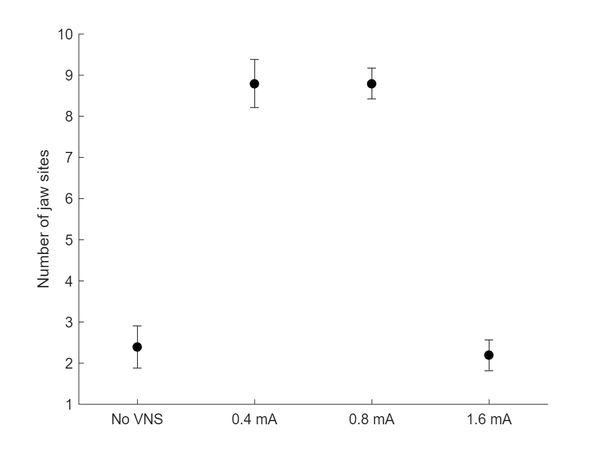
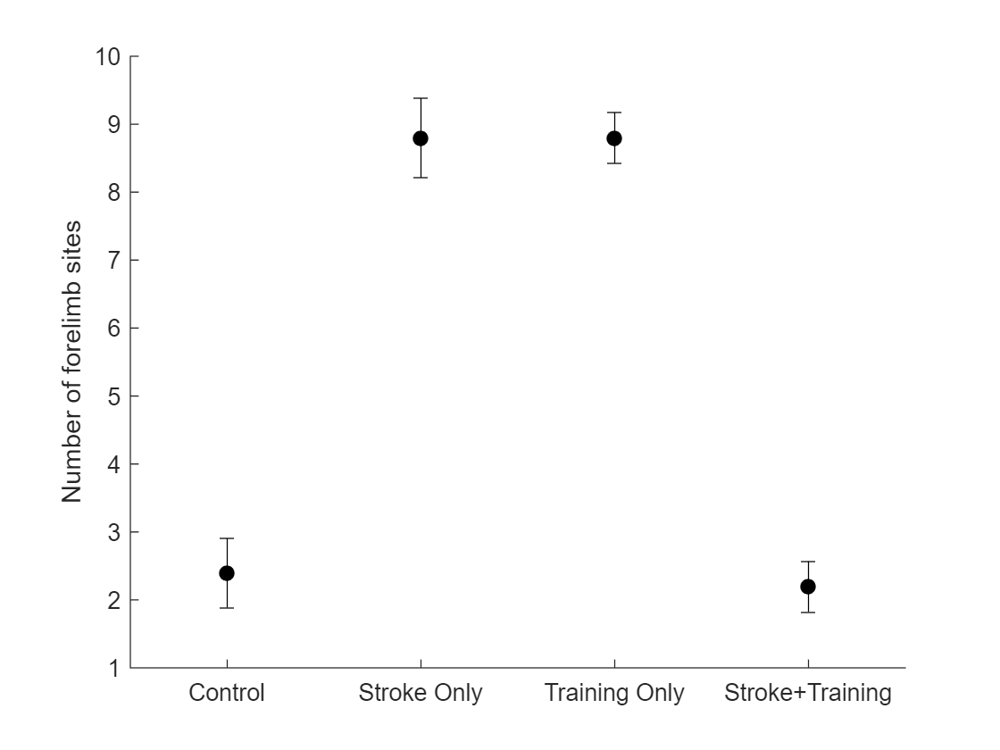
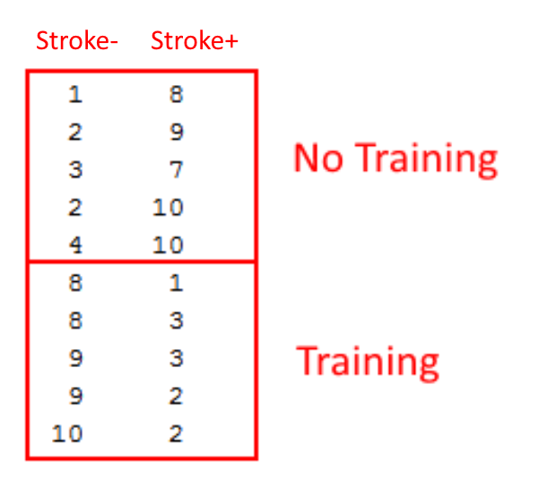
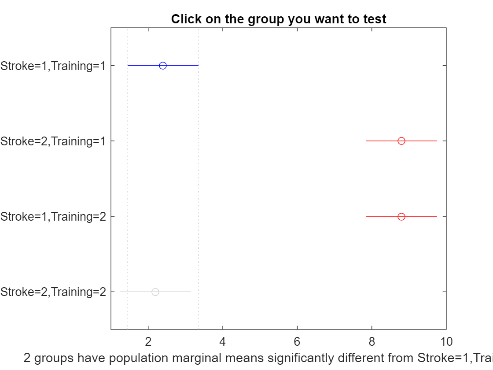
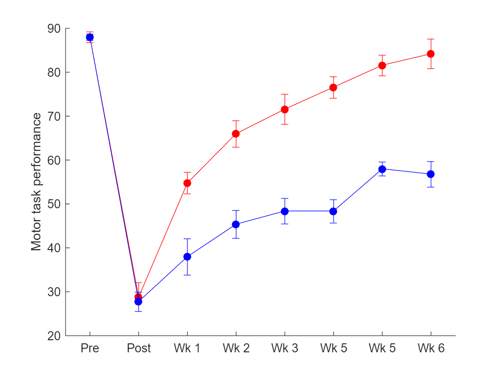

# Part 2: ANOVA (of all kinds)
  
## 2.1 Introduction
  

Now that we have a basic understanding of how to do t-tests in Matlab, how about doing an ANOVA? There are multiple kinds of ANOVAs, but generally you want to do an ANOVA if you are comparing multiple groups (more than 2) or multiple timepoints (more than 2).

The results of the ANOVA *do not immediately tell you which things are different from each other, rather it just says whether or not these is an "effect" of an experimental variable. *You must then use *post-hoc* tests to figure out where individual group differences occur.

Examples of when to use an ANOVA:

   -  Comparing the motor map data from four VNS groups: No VNS, 0.4 mA VNS, 0.8 mA VNS, and 1.6 mA VNS. This would use a *one-way ANOVA*. 
   -  Comparing the motor map data from four groups: No stroke + No VNS, No Stroke + VNS, Stroke + No VNS, Stroke + VNS. This would use a *two-way ANOVA*. 
   -  Compring one experimental group across multiple timepoints. This would use a *repeated-measures ANOVA*. 

  
## 2.2 ANOVA functions in Matlab
  

Matlab has a *lot* of ANOVA functions. Some of the most common that you will see/use are:

   -  `anova` 
   -  `anova1` 
   -  `anova2` 
   -  `anovan` 
   -  `ranova` 
   -  `manova` 

Each of these functions works differently. Because of this, it can be confusing which one to use and how to use it. So let's go over them and see how to use them.

  
## 2.3 One-Way ANOVA
  

A "one way ANOVA" indicates that there is one **factor**, which basically means you have one independent variable. This one variable, however, *can have multiple ****levels****. Do not get the number of ****levels**** confused with the number of ****factors****.*

Examples:

   -  A project has 2 groups, one group is receiving VNS and one group is not receiving VNS. In this project, we have one factor/variable (VNS). That factor has two levels (the presence or absence of VNS). 
   -  A project has 4 groups, all receiving different intensities of VNS. Once again, this project has one factor/variable: VNS. The number of levels depends on the number of intensitites being tested. For example, you could have 4 levels: No VNS, 0.4 mA, 0.8 mA, and 1.6 mA. 

Because these projects have **one factor**, you use a **one way ANOVA** when testing the data.

The following functions are most useful for doing a one-way ANOVA in Matlab:

   -  `anova1` 
   -  `anovan` 

  
## 2.4 Example of a one-way ANOVA
  

Let's do an example. Since I have done a fair amount of motor mapping, I will use motor maps for the context of this example.

Let's assume we want to test how VNS intensity affects reorganization of motor maps. Let's assume that animals were trained on a simple jaw-related chewing task, so our hypothesis is that VNS paired with chewing food would increase the total map area devoted to the jaw.

Let's create some example data:

```matlab:Code
%Create example jaw motor map data
map_data = [1 2 3 2 4 8 9 7 10 10 8 8 9 9 10 1 3 3 2 2]';
groups = [1 1 1 1 1 2 2 2 2 2 3 3 3 3 3 4 4 4 4 4]';

%Just to make sure Matlab prints enough decimal places during all the
%example code
format long g
```

In this example, `map_data` represents the number of "jaw" sites that were found in each animal's motor cortex map during the mapping procedure. The `groups` variable denotes which group each animal belongs to.

So we have 20 animals divided into 4 groups. Let's imagine our 4 groups are: No VNS, 0.4 mA VNS, 0.8 mA VNS, and 1.6 mA VNS.

Let's plot the data so we have an idea what it looks like:

```matlab:Code
%Get the mean and standard error for each group
no_vns_data = map_data(find(groups == 1));
vns_04_data = map_data(find(groups == 2));
vns_08_data = map_data(find(groups == 3));
vns_16_data = map_data(find(groups == 4));

no_vns_mean = nanmean(no_vns_data);
vns_04_mean = nanmean(vns_04_data);
vns_08_mean = nanmean(vns_08_data);
vns_16_mean = nanmean(vns_16_data);

no_vns_err = nanstd(no_vns_data) / sqrt(length(no_vns_data));
vns_04_err = nanstd(vns_04_data) / sqrt(length(vns_04_data));
vns_08_err = nanstd(vns_08_data) / sqrt(length(vns_08_data));
vns_16_err = nanstd(vns_16_data) / sqrt(length(vns_16_data));

%Now let's plot the data
figure;
hold on;

errorbar(1, no_vns_mean, no_vns_err, no_vns_err, 'color', 'k', 'marker', 'o', 'markerfacecolor', 'k');
errorbar(2, vns_04_mean, vns_04_err, vns_04_err, 'color', 'k', 'marker', 'o', 'markerfacecolor', 'k');
errorbar(3, vns_08_mean, vns_08_err, vns_08_err, 'color', 'k', 'marker', 'o', 'markerfacecolor', 'k');
errorbar(4, vns_16_mean, vns_16_err, vns_16_err, 'color', 'k', 'marker', 'o', 'markerfacecolor', 'k');
xlim([0.5 4.5]);
set(gca, 'xtick', 1:4);
set(gca, 'xticklabel', {'No VNS', '0.4 mA', '0.8 mA', '1.6 mA'});
ylabel('Number of jaw sites');
```



Okay, now that we have an idea of what our data looks like, let's try performing a one-way ANOVA on the data to test our hypothesis.

Initially, we will use the `anova1` function to do our one-way ANOVA.

```matlab:Code
[p, tbl, stats] = anova1(map_data, categorical(groups), 'off')
```

```text:Output
p = 
      3.92962246022135e-09

```

| |1|2|3|4|5|6|
|:--:|:--:|:--:|:--:|:--:|:--:|:--:|
|1|'Source'|'SS'|'df'|'MS'|'F'|'Prob>F'|
|2|'Groups'|211.35|3|70.45|64.0454545454544|3.92962246022135e-09|
|3|'Error'|17.6|16|1.1|[ ]|[ ]|
|4|'Total'|228.95|19|[ ]|[ ]|[ ]|

```text:Output
stats = 
    gnames: {4x1 cell}
         n: [5 5 5 5]
    source: 'anova1'
     means: [2.4 8.8 8.8 2.2]
        df: 16
         s: 1.04880884817015

```

We received a p-value of 3.92x10^-9, which means that there was a significant effect of VNS intensity on jaw motor map organization. Unfortunately, the ANOVA does *not* tell us which groups are different from each other. It only tells us that some effect of VNS intensity does exist.

Here is an example of how you would report this in a paper:

*"An analysis of variance revealed a significant effect of VNS intensity on jaw motor map area (p = 3.92x10^-9)."*

Sometimes, reviewers really like seeing the "F" value of the ANOVA reported as well. When reporting an "F" value, you must report the "Groups" degrees of freedom as well as the "Error" degrees of freedom. There is a standard way to write this. It's like this: `F(3, 16) = 64.05`.

So in the paper, you may want to write something like this:

*"A one-way ANOVA revealed a significant effect of VNS intensity on jaw motor map area (F(3, 16) = 64.05, p = 3.92x10^-9)."*

  
## 2.5 Post-hoc tests using `multcompare`
  

The `multcompare` function is specifically designed to perform multiple pair-wise comparisons on your data after having first done an ANOVA.

To use `multcompare`, simply pass it the `stats` variable that we created as an output of the `anova1` function above.

```matlab:Code
[c, m] = multcompare(stats, 'display', 'off')
```

```text:Output
c = 6x6    
                         1                         2         -8.29778593275269                      -6.4         -4.50221406724731      2.50053448427988e-07
                         1                         3         -8.29778593275269                      -6.4         -4.50221406724731      2.50053448427988e-07
                         1                         4         -1.69778593275269                       0.2          2.09778593275269         0.990107559612414
                         2                         3         -1.89778593275269                         0          1.89778593275269                         0
                         2                         4          4.70221406724731                       6.6          8.49778593275269       1.6353014835898e-07
                         3                         4          4.70221406724731                       6.6          8.49778593275269       1.6353014835898e-07

m = 4x2    
                       2.4         0.469041575982343
                       8.8         0.469041575982343
                       8.8         0.469041575982343
                       2.2         0.469041575982343

```

You will notice that it outputs two variables, which we have named "c" and "m". The "c" variable contains the comparison table. The first two columns represent the groups being compared, and the final column represents the p-value of the comparison. You will notice that if the p-value is too low, it just says "0.0000". So, in this case, we could not report the exact p-value in our paper.

In this specific example, it looks like the following significant differences exist:

   -  Groups 1 and 2 (No VNS vs 0.4 mA VNS) 
   -  Groups 1 and 3 (No VNS vs 0.8 mA VNS) 
   -  Groups 2 and 4 (0.4 mA VNS vs 1.6 mA VNS) 
   -  Groups 3 and 4 (0.8 mA VNS vs 1.6 mA VNS) 

Meanwhile, the following comparisons yielded high p-values, so no significant differences:

   -  Groups 1 and 4 (No VNS vs 1.6 mA VNS) 
   -  Groups 2 and 3 (0.4 mA VNS vs 0.8 mA VNS) 

Here is how you could possibly write this into your paper:

*"Post-hoc tests revealed that VNS intensities of 0.4 mA and 0.8 mA resulted in significantly greater jaw motor map area when compared to No VNS or 1.6 mA VNS (Tukey-Kramer, p < 0.001)."*

The `multcompare` function does a **Tukey-Kramer** post-hoc test by default. If you prefer to do a different test, such as **Bonferroni**, you can tell the multcompare function to do so:

```matlab:Code
[c, m] = multcompare(stats, 'display', 'off', 'ctype', 'bonferroni')
```

```text:Output
c = 6x6    
                         1                         2         -8.39550292497842                      -6.4         -4.40449707502158      2.70569578234971e-07
                         1                         3         -8.39550292497842                      -6.4         -4.40449707502158      2.70569578234971e-07
                         1                         4         -1.79550292497842                       0.2          2.19550292497842                         1
                         2                         3         -1.99550292497842                         0          1.99550292497842                         1
                         2                         4          4.60449707502158                       6.6          8.59550292497842      1.76739392410571e-07
                         3                         4          4.60449707502158                       6.6          8.59550292497842      1.76739392410571e-07

m = 4x2    
                       2.4         0.469041575982343
                       8.8         0.469041575982343
                       8.8         0.469041575982343
                       2.2         0.469041575982343

```

In this case, the results are comparable. Use whichever type of post-hoc test you prefer.

  
## 2.6 Post-hoc tests using Bonferroni-correct t-tests
  

If you don't want to use the `multcompare` function, you may manually do Bonferroni-corrected t-tests. Here is an example of how you could do that:

```matlab:Code
%Perform individual Bonferroni-correct t-tests
total_pairwise_comparisons = 6;
normal_alpha = 0.05;
bonferroni_corrected_alpha = normal_alpha / total_pairwise_comparisons;
[h, p] = ttest2(no_vns_data, vns_04_data, 'alpha', bonferroni_corrected_alpha)
```

```text:Output
h = 
     1

p = 
      3.45913402691634e-05

```

```matlab:Code
[h, p] = ttest2(no_vns_data, vns_08_data, 'alpha', bonferroni_corrected_alpha)
```

```text:Output
h = 
     1

p = 
      7.76846156806427e-06

```

```matlab:Code
[h, p] = ttest2(no_vns_data, vns_16_data, 'alpha', bonferroni_corrected_alpha)
```

```text:Output
h = 
     0

p = 
         0.759922968348739

```

```matlab:Code
[h, p] = ttest2(vns_04_data, vns_08_data, 'alpha', bonferroni_corrected_alpha)
```

```text:Output
h = 
     0

p = 
     1

```

```matlab:Code
[h, p] = ttest2(vns_04_data, vns_16_data, 'alpha', bonferroni_corrected_alpha)
```

```text:Output
h = 
     1

p = 
      1.21801296396594e-05

```

```matlab:Code
[h, p] = ttest2(vns_08_data, vns_16_data, 'alpha', bonferroni_corrected_alpha)
```

```text:Output
h = 
     1

p = 
      1.59612290825995e-06

```

  

Here is how you may report that in your paper:

*"Post-hoc tests revealed that VNS intensities of 0.4 mA and 0.8 mA resulted in significantly greater jaw motor map area than No VNS and 1.6 mA VNS (Bonferroni-corrected t-tests, adjusted alpha = 0.0083, p < 0.001)."*

  
## 2.7 A WARNING about using `anova1`
  

The `anova1` function can *only be used in balanced designs!!! *This means that ALL groups must have equal sample sizes. Having equal sample sizes *rarely happens in actual experiments, therefore I do not recommend using **`anova1`**. *I recommend using `anovan`, which has been specifically designed for "unbalanced" designs.

  
## 2.8 Performing a one-way ANOVA using `anovan`
  

Let's do the same exact thing we did above - a one-way ANOVA on our data - but let's use the `anovan` function instead of the `anova1` function.

Here is an example:

```matlab:Code
%Perform the one-way ANVOA
dependent_variable = map_data;
independent_variables = {categorical(groups)};
[p, tbl, stats] = anovan(dependent_variable, independent_variables, 'display', 'off', 'model', 'full', 'varnames', {'Group'});
tbl
```

| |1|2|3|4|5|6|7|
|:--:|:--:|:--:|:--:|:--:|:--:|:--:|:--:|
|1|'Source'|'Sum Sq.'|'d.f.'|'Singular?'|'Mean Sq.'|'F'|'Prob>F'|
|2|'Group'|211.35|3|0|70.45|64.0454545454548|3.92962246022119e-09|
|3|'Error'|17.5999999999999|16|0|1.1|[ ]|[ ]|
|4|'Total'|228.95|19|0|[ ]|[ ]|[ ]|

You will notice that we get the exact same result as we did with `anova1`. But using this function allows us more flexibility just in case we don't have the same number of subjects in each group.

  
## 2.9 Setting up an experiment for a two-way ANOVA
  

Now let's do a two-way ANOVA. We will use our same example mapping data, but we will switch up group assignments so that we have **2 factors**.

In our previous imaginary experiment, we had **1 factor**, which was "Intensity of VNS". That factor was divided into **4 levels**: No VNS, 0.4 mA VNS, 0.8 mA VNS, and 1.6 mA VNS.

In this new imaginary experiment, we will have **2 factors**: "Lesion" and "Motor Training".

Each variable will have **2 levels**:

   -  Lesion: did the animal receive a stroke or not? 
   -  Motor training: did the animal receive motor training or not? 

Note that there are still 4 groups, so the `map_data` and `groups` variables that we previously defined will still work in this new experiment, they just mean different things now.

Let's define our groups as such:

   -  Group 1: No stroke, No motor training 
   -  Group 2: Yes Stroke, No motor training 
   -  Group 3: No stroke, Yes motor training 
   -  Group 4: Yes Stroke, Yes motor training 

Our hypothesis is that there will be an effect of stroke on motor cortex map reorganization. Additionally, we also believe that motor training by itself will also affect motor cortex map reorganization. We believe there may also be an interaction effect of both stroke and motor training on motor cortex map reorganization.

Just to re-iterate, this is our data:

```matlab:Code
%Create example motor map data for Stroke/Motor Training imaginary
%experiment
map_data = [1 2 3 2 4 8 9 7 10 10 8 8 9 9 10 1 3 3 2 2]';
groups = [1 1 1 1 1 2 2 2 2 2 3 3 3 3 3 4 4 4 4 4]';
```

Let's re-plot the data just to remind ourselves what it looks like:

```matlab:Code
%Get the mean and standard error for each group
g1_data = map_data(find(groups == 1));
g2_data = map_data(find(groups == 2));
g3_data = map_data(find(groups == 3));
g4_data = map_data(find(groups == 4));

g1_mean = nanmean(g1_data);
g2_mean = nanmean(g2_data);
g3_mean = nanmean(g3_data);
g4_mean = nanmean(g4_data);

g1_err = nanstd(g1_data) / sqrt(length(g1_data));
g2_err = nanstd(g2_data) / sqrt(length(g2_data));
g3_err = nanstd(g3_data) / sqrt(length(g3_data));
g4_err = nanstd(g4_data) / sqrt(length(g4_data));

%Now let's plot the data
figure;
hold on;

errorbar(1, g1_mean, g1_err, g1_err, 'color', 'k', 'marker', 'o', 'markerfacecolor', 'k');
errorbar(2, g2_mean, g2_err, g2_err, 'color', 'k', 'marker', 'o', 'markerfacecolor', 'k');
errorbar(3, g3_mean, g3_err, g3_err, 'color', 'k', 'marker', 'o', 'markerfacecolor', 'k');
errorbar(4, g4_mean, g4_err, g4_err, 'color', 'k', 'marker', 'o', 'markerfacecolor', 'k');
xlim([0.5 4.5]);
set(gca, 'xtick', 1:4);
set(gca, 'xticklabel', {'Control', 'Stroke Only', 'Training Only', 'Stroke+Training'});
ylabel('Number of forelimb sites');
```



  
## 2.10 Performing a two-way ANOVA using `anova2`
  

Similar to `anova1`, the `anova2` function *only works on balanced designs!!!* Since this rarely occurs in real-world experiments, I generally recommend you don't use `anova2`, but I will give an example of how to use it just in case you do want to use it.

Another reason I don't recommend using `anova2` is because you have to set up your data in a really weird way, but oh well.

Here we go:

The `anova2` function expects your input matrix to basically be equally divided into quadrants representing each group. For our experiment, it would look like this:

```matlab:Code
map_data_anova2 = [1 8; 2 9; 3 7; 2 10; 4 10; 8 1; 8 3; 9 3; 9 2; 10 2]
```

```text:Output
map_data_anova2 = 10x2    
     1     8
     2     9
     3     7
     2    10
     4    10
     8     1
     8     3
     9     3
     9     2
    10     2

```

We do not have a separate "groups" variable when using `anova2`, because the group assignment of each animal is defined by its position in the matrix.

Here is how Matlab expects your matrix to be organized:



We then perform the two-way ANOVA like so:

```matlab:Code
%The "5" that is passed into the anova2 function indicates
%that there are 5 subjects per experimental condition.
%This must be a multiple of the number of rows in your matrix.
[p, tbl, stats] = anova2(map_data_anova2, 5, 'off');
tbl
```

| |1|2|3|4|5|6|
|:--:|:--:|:--:|:--:|:--:|:--:|:--:|
|1|'Source'|'SS'|'df'|'MS'|'F'|'Prob>F'|
|2|'Columns'|0.0500000000000005|1|0.0500000000000005|0.0454545454545462|0.833863249561689|
|3|'Rows'|0.0500000000000005|1|0.0500000000000005|0.0454545454545462|0.833863249561689|
|4|'Interaction'|211.25|1|211.25|192.045454545455|2.48988725127952e-10|
|5|'Error'|17.5999999999999|16|1.09999999999999|[ ]|[ ]|
|6|'Total'|228.95|19|[ ]|[ ]|[ ]|

  
## 2.11 Performing a two-way ANOVA using `anovan`
  

Let's immediately just show how to do the same thing using `anovan`.

Here is how we will define our data:

```matlab:Code
map_data = [1 2 3 2 4 8 9 7 10 10 8 8 9 9 10 1 3 3 2 2]';
stroke_condition = [1 1 1 1 1 1 1 1 1 1 2 2 2 2 2 2 2 2 2 2]';
training_condition = [1 1 1 1 1 2 2 2 2 2 1 1 1 1 1 2 2 2 2 2]';
```

Now let's set up the ANOVA and run it:

```matlab:Code
dependent_variable = map_data;
independent_variables = {categorical(stroke_condition) categorical(training_condition)};
[p, tbl, stats] = anovan(dependent_variable, independent_variables, 'display', 'off', 'model', 'full', 'varnames', {'Stroke', 'Training'});
tbl
```

| |1|2|3|4|5|6|7|
|:--:|:--:|:--:|:--:|:--:|:--:|:--:|:--:|
|1|'Source'|'Sum Sq.'|'d.f.'|'Singular?'|'Mean Sq.'|'F'|'Prob>F'|
|2|'Stroke'|0.0500000000000398|1|0|0.0500000000000398|0.0454545454545816|0.833863249561625|
|3|'Training'|0.0500000000000398|1|0|0.0500000000000398|0.0454545454545816|0.833863249561625|
|4|'Stroke*Training'|211.25|1|0|211.25|192.045454545455|2.48988725127959e-10|
|5|'Error'|17.6|16|0|1.1|[ ]|[ ]|
|6|'Total'|228.95|19|0|[ ]|[ ]|[ ]|

In my opinion, this is a much clearer way to set up your data and organize your code than that weird way `anova2` expects. The results of the two functions are equivalent, and the `anovan` function also supports unbalanced designs, which is highly likely to occur in your own experiments.

Moral of the story: use `anovan`. Don't bother with using either `anova1` or `anova2`, unless you really have to for some odd reason.

Make sure to be careful how you interpret the effects of a two-way ANOVA. In this example, the way-way ANOVA indicates there is no main effect for either Stroke or Training. This is because the two-way ANOVA takes the average of *all* subjects who fall into that condition. So, if you take the average of *all* subjects that received no stroke, and the average of *all* subjects that did receive a stroke (regardless of their Training condition), they would look pretty much the same. So it thinks there is no effect of Stroke, which is actually incorrect.

According to Laerd Statistics (https://statistics.laerd.com/spss-tutorials/two-way-anova-using-spss-statistics-2.php): **"When you have a statistically significant interaction, reporting main effects can be misleading. Therefore, you will need to report the simple main effects" (i.e. post-hoc tests).**

Also, see this Stats Exchange post about interpreting main effects in the presence of an interaction effect: [https://stats.stackexchange.com/questions/93667/how-does-the-interpretation-of-main-effects-in-a-two-way-anova-change-depending](https://stats.stackexchange.com/questions/93667/how-does-the-interpretation-of-main-effects-in-a-two-way-anova-change-depending)

  
## 2.12 Multiple comparisons for a two-way ANOVA
  

Performing multiple comparisons is simply done using the `multcompare` function:

```matlab:Code
multcompare(stats, 'dim', 1:2)
```



```text:Output
ans = 6x6    
                         1                         2         -8.29778593275269                      -6.4         -4.50221406724731      2.50053448427987e-07
                         1                         3         -8.29778593275269                      -6.4         -4.50221406724731      2.50053448427982e-07
                         1                         4         -1.69778593275269         0.200000000000002          2.09778593275269         0.990107559612414
                         2                         3         -1.89778593275269                         0          1.89778593275269                         0
                         2                         4          4.70221406724731                       6.6          8.49778593275269      1.63530148358979e-07
                         3                         4          4.70221406724731                       6.6          8.49778593275269      1.63530148358979e-07

```

  
## 2.13 Writing a two-way ANOVA into your paper
  

Here is an example of how you could write the results of a two-way ANOVA into your paper:

*"A significant interaction of training and stroke injury was observed (F(1, 16) = 192.05, p < 0.001). Upon closer inspection, we found that stroke by itself resulted in an increase of forelimb motor map area in untrained animals (Tukey-Kramer, Stroke-/Training- vs Stroke+/Training-, p < 0.001). Additionally, training alone also resulted in an expansion of forelimb map area (Tukey-Kramer, Stroke-/Training- vs Stroke-/Training+, p < 0.001). Interestingly, when stroke occurred in addition to motor training, no forelimb motor map expansion was observed (Tukey-Kramer, Stroke-/Training- vs Stroke+/Training+, p = 0.99). This suggests that..."*

  
## 2.14 Repeated-Measures ANOVA
  

Repeated-measures ANOVA should be used when comparing data across multiple timepoints. One classic example from our lab is comparing behavior data in the therapy stage of a study.

When doing repeated-measures ANOVA, you will be using a combination of three functions:

   -  `fitrm` 
   -  `ranova` 
   -  `anova` 

*Note: ****anova**** is not the same as ****anova1****, ****anova2****, or ****anovan****.*

To set things up, let's go ahead and define some group data.

```matlab:Code
%We will use a function that Iwrote to randomly generate some group data
[data, groups] = GenerateRatData_2_Groups(5, 5)
```

```text:Output
data = 10x8    
    89    28    56    57    80    70    77    93
    92    34    60    63    75    84    83    77
    85    24    46    75    65    74    89    77
    88    38    54    66    76    75    83    91
    86    20    58    69    62    80    76    83
    86    34    48    41    49    41    56    48
    87    28    31    49    59    52    58    64
    88    31    30    52    46    43    55    52
    89    22    33    35    46    52    64    60
    90    24    48    50    42    54    57    60

groups = 10x1    
     1
     1
     1
     1
     1
     2
     2
     2
     2
     2

```

Let's take a look at our data:

```matlab:Code
%Get the data for each experimental group
g1_data = data(find(groups == 1), :);
g2_data = data(find(groups == 2), :);

g1_means = nanmean(g1_data, 1);
g2_means = nanmean(g2_data, 1);

g1_errs = nanstd(g1_data) / sqrt(size(g1_data, 1));
g2_errs = nanstd(g2_data) / sqrt(size(g2_data, 1));

%Plot our data
figure;
hold on;
t = 1:8;
errorbar(t, g1_means, g1_errs, g1_errs, 'color', 'r', 'marker', 'o', 'markerfacecolor', 'r');
errorbar(t, g2_means, g2_errs, g2_errs, 'color', 'b', 'marker', 'o', 'markerfacecolor', 'b');
ylabel('Motor task performance');
xlim([0.5 8.5]);
set(gca, 'xtick', 1:8);
set(gca, 'xticklabel', {'Pre', 'Post', 'Wk 1', 'Wk 2', 'Wk 3', 'Wk 5', 'Wk 5', 'Wk 6'});
```


  

Now that we know what our data looks like, let's ask some experimental questions:

**"Did the VNS group significantly recover compared to its post-lesion baseline?"**

To answer this question, we can use `ranova`:

```matlab:Code
%Make copies of the data to use for this
d = g1_data;

%Exclude the pre-lesion data. It won't be used in this statistical test.
d(:, 1) = [];

%Create a table to pass to the fitrm function, because fitrm requires that
%data be in table format
t = table(d(:, 1), d(:, 2), d(:, 3), d(:, 4), d(:, 5), d(:, 6), d(:, 7), 'VariableNames', {'Post', 'Wk1', 'Wk2', 'Wk3', 'Wk4', 'Wk5', 'Wk6'});
timepoints = 1:size(d, 2);

%Execute the fitrm function to fit our data to a repeated-measure model
rm = fitrm(t, 'Post-Wk6~1', 'WithinDesign', timepoints);

%Execute the repeated-measures anova
ranova_tbl = ranova(rm)
```

| |SumSq|DF|MeanSq|F|pValue|pValueGG|pValueHF|pValueLB|
|:--:|:--:|:--:|:--:|:--:|:--:|:--:|:--:|:--:|
|1 (Intercept):Time|11136.1714285714|6|1856.02857142857|41.7040445110207|1.55295063914507e-11|8.32299596657341e-06|1.55295063914507e-11|0.00296055957971663|
|2 Error(Time)|1068.11428571429|24|44.5047619047619|1|0.5|0.5|0.5|0.5|

**Writing this up in a paper:** "A repeated-measures ANOVA revealed that there was a significant effect on motor task performance in the VNS group throughout the post-lesion therapy period (F(6, 24) = 41.7, p = 1.55x10^-11)."

**A note on pValueGG: **This is the "Greenhouse Geiser" p-value. In certain situations, you may need to use this p-value instead of the regular p-value. To determine this, you need to first do a **mauchly** **test**.

```matlab:Code
mauchly_result = mauchly(rm)
```

| |W|ChiStat|DF|pValue|
|:--:|:--:|:--:|:--:|:--:|
|1|0|Inf|20|0|

If the p-value returned from the mauchly test is less than 0.05, then you shuld use the pValueGG in the ranova output, otherwise, just use the regular pValue.

The Mauchly test is a test for "sphericity" - essentially just to see if the variance in your data is approximately equal at all timepoints, and then to correct for it if it isn't.

  
## 2.15 Comparing groups across time with a repeated-measures ANOVA
  

Let's say we want to ask the question: **"Was there an effect of VNS?"**. I actually *don't* recommend using a repeated-measures ANOVA to do this. I think a better idea would be to refine the question: **"At the end of therapy, was there an effect of VNS?"**. By doing this, we can simply look at the final timepoint of the experiment, run a t-test across the two groups (or an ANOVA across multiple groups) at that single timepoint, and then get the answer. That's typically what we want to know anyways: how did everything look at the end of the experiment? Did VNS do something such that we see a difference between the groups?

But, maybe you want to look at the main effect of group across all timepoints. To do this, we can still use a repeated-measures model, but we will end up using the `anova` function. Here's how it looks:

```matlab:Code
%Make copies of the data to use for this
d = data;

%Exclude the pre-lesion data. It won't be used in this statistical test.
d(:, 1) = [];

%Create a table to pass to the fitrm function, because fitrm requires that
%data be in table format
t = table(categorical(groups), d(:, 1), d(:, 2), d(:, 3), d(:, 4), d(:, 5), d(:, 6), d(:, 7), 'VariableNames', {'Group', 'Post', 'Wk1', 'Wk2', 'Wk3', 'Wk4', 'Wk5', 'Wk6'});
timepoints = 1:size(d, 2);

%Execute the fitrm function to fit our data to a repeated-measure model
rm = fitrm(t, 'Post-Wk6~Group', 'WithinDesign', timepoints);

%This test will tell you the effects of time and group*time interaction.
ranova_tbl = ranova(rm)
```

| |SumSq|DF|MeanSq|F|pValue|pValueGG|pValueHF|pValueLB|
|:--:|:--:|:--:|:--:|:--:|:--:|:--:|:--:|:--:|
|1 (Intercept):Time|13182.7428571428|6|2197.12380952381|49.7448586291474|6.1063125679625e-19|1.2333538312513e-13|6.1063125679625e-19|0.000106850401880606|
|2 Group:Time|1291.77142857143|6|215.295238095238|4.87447777687932|0.00058300917254001|0.00312371427280702|0.00058300917254001|0.0582786489967249|
|3 Error(Time)|2120.05714285714|48|44.1678571428571|1|0.5|0.5|0.5|0.5|

```matlab:Code

%This test will tell you the main effect of group
anova_tbl = anova(rm)
```

| |Within|Between|SumSq|DF|MeanSq|F|pValue|
|:--:|:--:|:--:|:--:|:--:|:--:|:--:|:--:|
|1|Constant|constant|220866.057142771|1|220866.057142771|6925.25151175541|4.84920726250624e-13|
|2|Constant|Group|7080.22857142856|1|7080.22857142856|222.00044792833|4.0591661950167e-07|
|3|Constant|Error|255.142857142858|8|31.8928571428572|1|0.5|

**How would you report this in a paper?**

*"A significant interaction was observed between the experimental group of the animals and the stage at which the animals were in the experimental timeline (F(6, 48) = 4.87, p = 0.003). Additionally, we observed a main effect of VNS (F(1, 8) = 222, p < 0.001), and a main effect of time (F(6, 48) = 18.2, p < 0.001). Post-hoc tests revealed VNS animals had significantly greater motor task performance than No VNS animals during all weeks of therapy (unpaired-tests at each time-point, all p < 0.001)."*

  
## 2.16 How I would actually report this experiment
  

Okay, let's take some example data and run through *every test I would do, and every comparison I would make, and how I would report it in a paper*.

For our example data, we will use the same data as we were just using above. But for the sake of reminding ourselves, here it is:

```matlab:Code
%We will use a function that Iwrote to randomly generate some group data
[data, groups] = GenerateRatData_2_Groups(5, 5)
```

```text:Output
data = 10x8    
    89    28    56    57    80    70    77    93
    92    34    60    63    75    84    83    77
    85    24    46    75    65    74    89    77
    88    38    54    66    76    75    83    91
    86    20    58    69    62    80    76    83
    86    34    48    41    49    41    56    48
    87    28    31    49    59    52    58    64
    88    31    30    52    46    43    55    52
    89    22    33    35    46    52    64    60
    90    24    48    50    42    54    57    60

groups = 10x1    
     1
     1
     1
     1
     1
     2
     2
     2
     2
     2

```

```matlab:Code

%Get the data for each experimental group
g1_data = data(find(groups == 1), :);
g2_data = data(find(groups == 2), :);

g1_means = nanmean(g1_data, 1);
g2_means = nanmean(g2_data, 1);

g1_errs = nanstd(g1_data) / sqrt(size(g1_data, 1));
g2_errs = nanstd(g2_data) / sqrt(size(g2_data, 1));

%Plot our data
figure;
hold on;
t = 1:8;
errorbar(t, g1_means, g1_errs, g1_errs, 'color', 'r', 'marker', 'o', 'markerfacecolor', 'r');
errorbar(t, g2_means, g2_errs, g2_errs, 'color', 'b', 'marker', 'o', 'markerfacecolor', 'b');
ylabel('Motor task performance');
xlim([0.5 8.5]);
set(gca, 'xtick', 1:8);
set(gca, 'xticklabel', {'Pre', 'Post', 'Wk 1', 'Wk 2', 'Wk 3', 'Wk 5', 'Wk 5', 'Wk 6'});
```



Now, here are the experimental questions that I will approach this data with:

   1.  Was there a significant impairment in motor performance due to stroke? 
   1.  Was there an equal impairment across experimental groups? 
   1.  Did we observe significant recovery in the VNS group? 
   1.  Did we observe significant recovery in the No VNS group? 
   1.  Was the recovery in the VNS group greater than the recovery in the No VNS group? 

Let's do the stats:

```matlab:Code
%Question 1: Was there a significant impairment in motor performance due to
%stroke?
[h1, p1] = ttest(g1_data(:, 1), g1_data(:, 2));
[h2, p2] = ttest(g2_data(:, 1), g2_data(:, 2));
disp(['VNS group, pre vs post, p = ' num2str(p1)]);
```

```text:Output
VNS group, pre vs post, p = 2.3221e-05
```

```matlab:Code
disp(['No VNS group, pre vs post, p = ' num2str(p2)]);
```

```text:Output
No VNS group, pre vs post, p = 2.8385e-05
```

```matlab:Code

%Question 2: Was there an equal impairment across experimental groups?
[h3, p3] = ttest2(g1_data(:, 2), g2_data(:, 2));
disp(['No VNS vs VNS group, post-lesion, p = ' num2str(p3)]);
```

```text:Output
No VNS vs VNS group, post-lesion, p = 0.80578
```

```matlab:Code

%Question 3: Did we observe a significant recovery in the VNS group?
d = g1_data;
d(:, 1) = [];
t = table(d(:, 1), d(:, 2), d(:, 3), d(:, 4), d(:, 5), d(:, 6), d(:, 7), 'VariableNames', {'Post', 'Wk1', 'Wk2', 'Wk3', 'Wk4', 'Wk5', 'Wk6'});
timepoints = 1:size(d, 2);
rm = fitrm(t, 'Post-Wk6~1', 'WithinDesign', timepoints);
ranova_tbl = ranova(rm)
```

| |SumSq|DF|MeanSq|F|pValue|pValueGG|pValueHF|pValueLB|
|:--:|:--:|:--:|:--:|:--:|:--:|:--:|:--:|:--:|
|1 (Intercept):Time|11136.1714285714|6|1856.02857142857|41.7040445110207|1.55295063914507e-11|8.32299596657341e-06|1.55295063914507e-11|0.00296055957971663|
|2 Error(Time)|1068.11428571429|24|44.5047619047619|1|0.5|0.5|0.5|0.5|

```matlab:Code

%Question 4: Did we observe a significant recovery in the No VNS group?
d = g2_data;
d(:, 1) = [];
t = table(d(:, 1), d(:, 2), d(:, 3), d(:, 4), d(:, 5), d(:, 6), d(:, 7), 'VariableNames', {'Post', 'Wk1', 'Wk2', 'Wk3', 'Wk4', 'Wk5', 'Wk6'});
timepoints = 1:size(d, 2);
rm = fitrm(t, 'Post-Wk6~1', 'WithinDesign', timepoints);
ranova_tbl = ranova(rm)
```

| |SumSq|DF|MeanSq|F|pValue|pValueGG|pValueHF|pValueLB|
|:--:|:--:|:--:|:--:|:--:|:--:|:--:|:--:|:--:|
|1 (Intercept):Time|3338.34285714285|6|556.390476190475|12.6940083654734|1.97752176858529e-06|0.000512172652340842|1.97752176858529e-06|0.0235255536303473|
|2 Error(Time)|1051.94285714286|24|43.8309523809524|1|0.5|0.5|0.5|0.5|

```matlab:Code

%Question 5: Was the recovery in the VNS group greater than the recovery in
%the No VNS group?
[h4, p4] = ttest2(g1_data(:, end), g2_data(:, end));
disp(['No VNS vs VNS group, end-of-therapy, p = ' num2str(p4)]);
```

```text:Output
No VNS vs VNS group, end-of-therapy, p = 0.00028485
```

```matlab:Code

```

**We would then write up the full results like this:**

*"Rats were trained on the isometric pull task before receiving an ischemic lesion in the motor cortex. Before receiving the lesion, both groups were highly skilled at the task (No VNS = 88 ± 0.7% success, VNS = 88 ± 1.2% success). Following the lesion, both groups experienced significant impairments in motor function (paired t-test of pre vs post performance; No VNS p = 2.83x10^-5, VNS p = 2.32x10^-5). We did not observe a significant difference in post-lesion performance between the two groups before beginning VNS therapy (unpaired t-test of No VNS vs VNS at post timepoint, p = 0.81).*

*After initially assessing post-lesion performance, animals were divided into experimental groups. One group received VNS paired with successful trials on the isometric pull task, while the other group also trained on the isometric pull task but did not receive any VNS. We found that both groups showed an increase in performance during the period of rehabilitative motor training (repeated-measures ANOVA; No VNS, F(6, 24) = 12.7, p < 0.001; VNS, F(6, 24) = 41.7, p < 0.001). Although some recovery was observed in both groups, the VNS group experienced significantly greater recovery of motor function than the No VNS group (No VNS = 57 ± 3%; VNS = 84 ± 3%; unpaired t-test, No VNS vs VNS at end-of-therapy, p = 0.0002)."*
