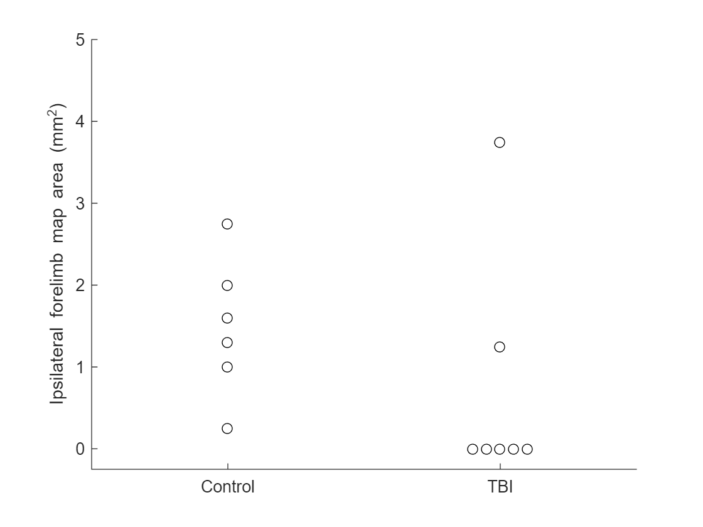

# Part 3: Tests for normality
  
## 3.1 Introduction
  

Up until now we have covered t-tests and ANOVAs. These are *parametric* tests. Parametric tests typically make some assumptions that your data is quantitative and that it is normally distributed. It is often times important to verify that your data is actually normally distributed before you run statistical tests on the data.

Matlab has several functions for testing "normality" of your data:

   1.  Lilliefors test - `lillietest` 
   1.  `Anderson-Darling test - `adtest 
   1.  Jarque-Bera test - `jbtest` 
   1.  `Kolmogorov-Smirnov test - kstest` 
   1.  `Kolmogorov-Smirnov test (2 samples) - kstest2` 

`In most circumstances, I generally recommend using lillietest`.

  
## 3.2 `lillietest`
  

`Lilliefors Test is a normality test based on the Kolmogorov-Smirnov test (the "ks test"). It is used to test the null hypothesis that the data in your sample comes from a normally distributed population. A low p-value indicates that the data is significantly different from normal.`

`Let's create some example data:`

```matlab:Code
%Group 1: normally distributed data
g1_data = [0.25 1 1.3 1.6 2.0 2.75];

%Group 2: this group will exhibit a floor effect in its data
g2_data = [0 0 0 0 0 1.25 3.75];
```

Let's take a look at our data:

```matlab:Code
figure;
hold on;

x1 = zeros(length(g1_data), 1) + 1;
x2 = [1.9 1.95 2 2.05 2.1 2 2];
plot(x1, g1_data, 'linestyle', 'none', 'marker', 'o', 'color', 'k');
plot(x2, g2_data, 'linestyle', 'none', 'marker', 'o', 'color', 'k');
xlim([0.5 2.5]);
ylim([-0.25 5]);
ylabel('Ipsilateral forelimb map area (mm^2)');
set(gca, 'xtick', [1 2]);
set(gca, 'ytick', 0:5);
set(gca, 'xticklabel', {'Control', 'TBI'});
```



  

To test whether each of these groups is normally distributed, do the following:

```matlab:Code
[h1, p1] = lillietest(g1_data, 'MCTol', 0.001);
[h2, p2] = lillietest(g2_data, 'MCTol', 0.001);
disp(['Group 1, lilliefors test, p = ' num2str(p1)]);
```

```text:Output
Group 1, lilliefors test, p = 0.9958
```

```matlab:Code
disp(['Group 2, lilliefors test, p = ' num2str(p2)]);
```

```text:Output
Group 2, lilliefors test, p = 0
```

  

**Reporting in a paper:**

*"We experienced a floor-effect in the TBI group, such that the ipsilateral motor map forelimb area did not match a normal distribution (Lilliefors test, p < 0.001). Therefore, ..."*

  
## 3.3 `adtest `and` jbtest`
  

`The functions adtest `and` jbtest` work pretty much the same as `lillietest`. Here are examples:

```matlab:Code
[h, p] = adtest(g1_data)
```

```text:Output
Warning: P is greater than the largest tabulated value, returning 0.99.
h = 
   0

p = 
                      0.99

```

```matlab:Code
[h, p] = adtest(g2_data)
```

```text:Output
Warning: P is less than the smallest tabulated value, returning 0.0005.
h = 
   1

p = 
                    0.0005

```

```matlab:Code
[h, p] = jbtest(g1_data)
```

```text:Output
Warning: P is greater than the largest tabulated value, returning 0.5.
h = 
     0

p = 
                       0.5

```

```matlab:Code
[h, p] = jbtest(g2_data)
```

```text:Output
h = 
     1

p = 
       0.00912280042186143

```

The main reason I like `lillietest` the best is that, in my own anecdotal experience, it seems to do the best job at identifying whether data is normally distributed or not.

  
## 3.4 kstest
  

The function `kstest` can also be used to test if a sample is normally distributed. If you use `kstest`, however, you *must correct your distribution by its mean and standard deviation!*

This is what happens if you *don't* correct it:

```matlab:Code
[h, p] = kstest(g1_data)
```

```text:Output
h = 
   1

p = 
       0.00318474293234461

```

Notice that it gives us a significant p-value of 0.00318, but this is *wrong!!!* The data from this group does match a normal distribution. So we need to first properly correct the data so that it matches what the `kstest` function expects:

```matlab:Code
g1_mean = nanmean(g1_data);
g1_std = nanstd(g1_data);
g1_corrected_data = (g1_data - g1_mean) ./ g1_std;
[h, p] = kstest(g1_corrected_data)
```

```text:Output
h = 
   0

p = 
         0.993257162500696

```

Now we have a p-value of 0.993, which clearly indicates (and *correctly *indicates) that the data in this group is normally distributed.

  
## 3.5 `kstest2`
  

The 2-sample kstest, `kstest2`, can be used to test if two groups in your data come from the same continuous distribution. The data does not need to be corrected for mean and standard deviation like in the 1-sample kstest.

```matlab:Code
[h, p] = kstest2(g1_data, g2_data)
```

In this case, the 2-sample kstest correctly tells us that the subjects in group 1 and the subjects in group 2 do not match the same statistical distribution.

*Note: the 2-sample kstest is somewhat similar to an unpaired t-test. See this link for some comments on that: *[*https://stats.stackexchange.com/questions/208517/kolmogorov-smirnov-test-vs-t-test*](https://stats.stackexchange.com/questions/208517/kolmogorov-smirnov-test-vs-t-test)

A key difference between the t-test and the 2-sample KS test is that the t-test compares two groups on the basis of a measure of central tendency. The KS test compares the groups on the basis of statistical distance, and is usually used as a goodness-of-fit test.
