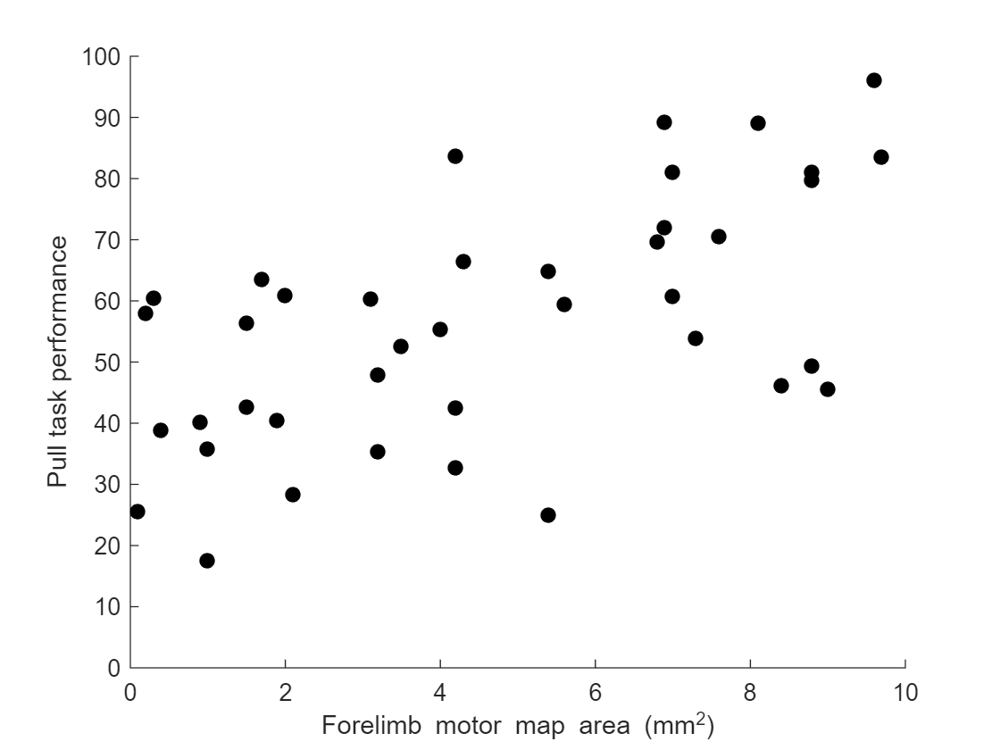
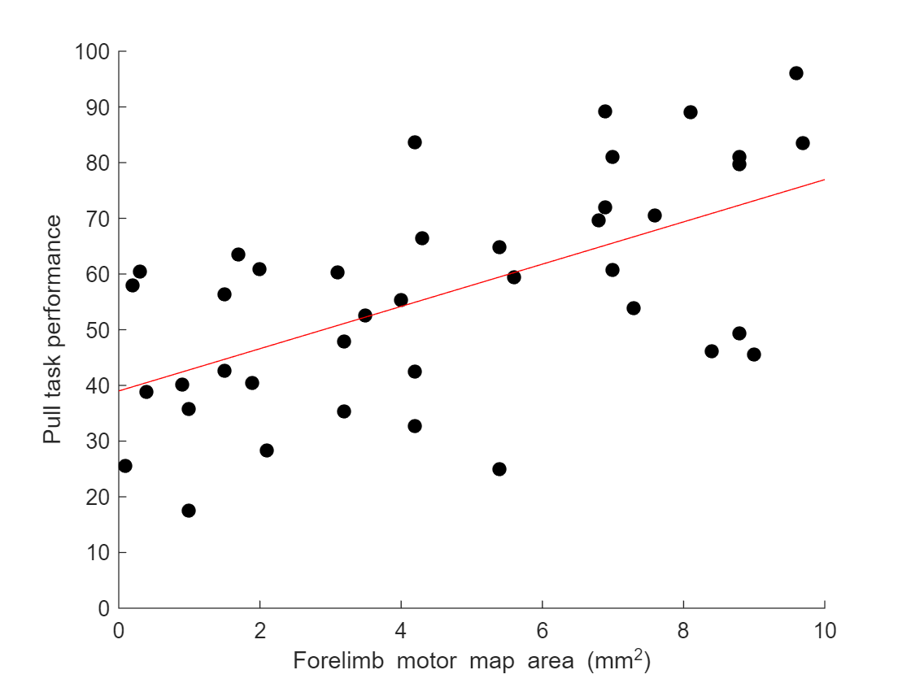

# Part 5: Chi-Square, Correlation, and Linear Regression
  
## 5.1 Introduction
  

A Chi-Squared test helps us to assess whether observations are mutually exclusive. Matlab's Chi-Squared function is called `crosstab`.

  

A Pearson or Spearman correlation is useful for testing whether there is an association between two variables. The function for doing this in Matlab is `corr`.

  

Linear regression takes correlation one step further, and calculates a linear function to fit the sample data. There are a *lot* of regression functions in Matlab. Here, we will only focus on `polyfit`.

  
## 5.2 Chi-Squared Test
  

The Chi-Squared test (denoted χ²) can be used to determine if observations fall into a corresponding "class", or the likelihood that two sets of observations fall into the same "class". 

Imagine we have 2 sets of observations: motor map from control animals, and motor maps from animals that have received a TBI. In each map, we simply record whether ot not any ipsilateral forelimb responses were present.

Here is the dataset:

| Group | Ipsi Responses? |
| --- | --- |
| Control | Yes |
| Control | Yes |
| Control | Yes |
| Control | Yes |
| Control | Yes |
| Control | Yes |
| TBI | Yes |
| TBI | Yes |
| TBI | No |
| TBI | No |
| TBI | No |
| TBI | No |
| TBI | No |


We could define the dataset like so in Matlab:

```matlab:Code
ipsi_responses = [1 1 1 1 1 1 1 1 0 0 0 0 0];
groups = [1 1 1 1 1 1 2 2 2 2 2 2 2];
```

  

From the dataset, we can build a *frequency table*, which is used in the Chi-Square test:

| | Ipsi Responses | No Ipsi Responses |
| --- | --- | --- |
| Control | 6 | 0 |
| TBI | 2 | 5 |


So with the Chi-Squared test, we are basically asking if the frequency of responses in one group seems to be the same or different from the frequency of responses in another group.

Here is Matlab code to do the Chi-Squared test:

```matlab:Code
[tbl, chi2, p] = crosstab(ipsi_responses, groups)
```

```text:Output
tbl = 2x2    
     0     5
     6     2

chi2 = 
          6.96428571428572

p = 
       0.00831526207035314

```

You will notice the output contains 3 items: the frequency table, the Chi-Squared statistics, and the p-value of the Chi-Squared test.

  
## 5.3 Correlation
  

A correlation analysis is meant to determine whether there is a linear relationship between two variables. It does not determine whether one variable causes the other.

Let's generate some imaginary data that we can use for a correlation analysis. Let's suppose that we did a motor mapping study, and we ask the question: **"Is there a relationship between the size of the forelimb area in motor cortex maps and the subject's performance on a motor task?"**

To answer this question, we need to know two things:

   1.  Each subject's performance on the motor task 
   1.  The size of the forelimb area in each subject's motor cortex map 

So let's generate some fake data to represent that:

```matlab:Code
%This "rng" code just ensures that the example is repeatable, because it
%will generate the same random numbers each time
rng('default');
rng(1);

%x_values will represent the "forelimb motor map area"
%y_values will represent the "motor task performance"

x_values = (randi([1 100], 40, 1));
y_values = nan(40, 1);

for i = 1:40
    y_values(i) = x_values(i) + ((rand - 0.5) * (200 * rand)) + 10;
end

y_values = y_values + (abs(min(y_values)) * 2);
y_values = (y_values ./ (max(y_values)+10)) * 100;
x_values = x_values ./ 10;
```

  

Now that we have generated some data, let's plot it so we know what it looks like:

```matlab:Code
figure;
hold on;
ylim([0 100]);
plot(x_values, y_values, 'Marker', 'o', 'LineStyle', 'none', 'MarkerFaceColor', 'k', 'Color', 'k');
ylabel('Pull task performance');
xlabel('Forelimb motor map area (mm^2)');
```



Now, let's do a correlation analysis on the data:

```matlab:Code
[r, p] = corr(x_values, y_values)
```

```text:Output
r = 
         0.591472442761871

p = 
      5.83874703513884e-05

```

Matlab gives us two variables as the result: the "r" value is the correlation coefficient, and the "p" value will tell us about the statistical significance of the correlation.

**How to write it in a paper:**

*"We found that there was an association between forelimb motor map area and performance on the pull task (Pearson correlation, r = 0.59, p = 5.84x10^-5)."*

**Statistics Note:**

r^2, often denote R^2 with a capital "R", is the "percentage of variance explained". In this case, r^2 = 0.348, so we could also say:

*"35% of the variance in pull task performance is explained by forelimb motor map area."*

  
## 5.4 Linear Regression
  

Linear regression is basically the next step in a correlation analysis. Linear regression fits a line to the data, and we call it a "best fit" line.

We want the line in the form of: y = mx + b

```matlab:Code
coeffs = polyfit(x_values, y_values, 1)
```

```text:Output
coeffs = 1x2    
          3.79490616393496          39.0032172897086

```

```matlab:Code
m = coeffs(1)
```

```text:Output
m = 
          3.79490616393496

```

```matlab:Code
b = coeffs(2)
```

```text:Output
b = 
          39.0032172897086

```

Note: the final parameter of polyfit indicates how many factors the polynomial should have. For example, if you put a "2", you would get 3 coefficients as the result, and they would fit an equation of the form: y = ax^2 + bx + c

We can now plot our best fit line onto our data:

```matlab:Code
x1 = 0;
x2 = 10;
y1 = m * x1 + b;
y2 = m * x2 + b;
figure;
hold on;
ylim([0 100]);
plot(x_values, y_values, 'Marker', 'o', 'LineStyle', 'none', 'MarkerFaceColor', 'k', 'Color', 'k');
ylabel('Pull task performance');
xlabel('Forelimb motor map area (mm^2)');
line([x1 x2], [y1 y2], 'Color', 'r');
```


